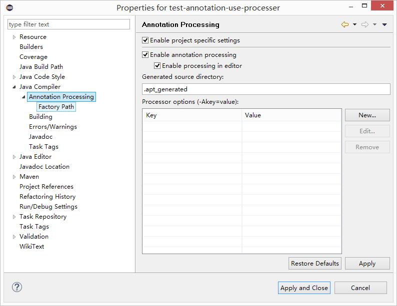
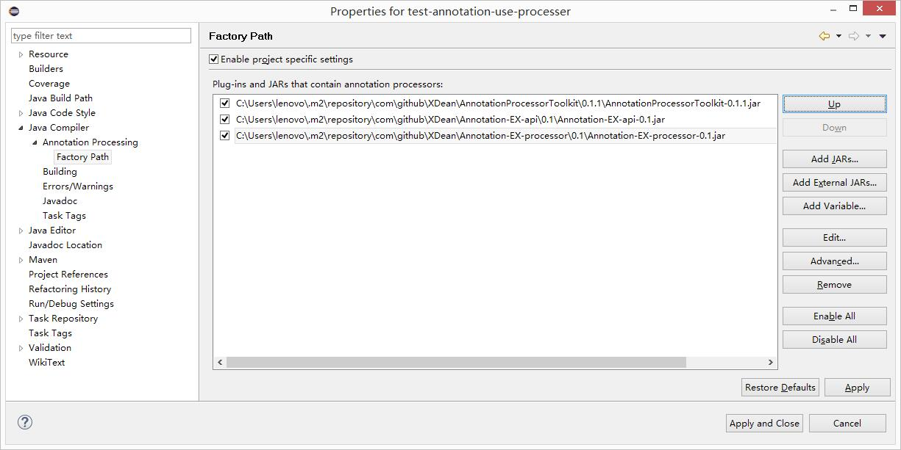

# Annotation-EX
[](https://travis-ci.org/XDean/Annotation-EX)
[](https://codecov.io/gh/XDean/Annotation-EX/branch/master)
[](https://maven-badges.herokuapp.com/maven-central/com.github.XDean/Annotation-EX)

# Release

**maven**

```xml
<dependency>
  <groupId>com.github.XDean</groupId>
  <artifactId>Annotation-EX-api</artifactId>
  <version>0.1</version>
</dependency>
<dependency>
  <groupId>com.github.XDean</groupId>
  <artifactId>Annotation-EX-processor</artifactId>
  <version>0.1</version>
</dependency>
```

Or

```xml
<dependency>
    <groupId>com.github.XDean</groupId>
    <artifactId>Annotation-EX</artifactId>
    <version>0.1</version>
</dependency>
```
<sup>0.1 not support this yet</sup>

# Features
- [@MethodRef](#methodref)
- [Use in Eclipse](#use-in-eclipse)


## @MethodRef
### Goal
Provide a compile safe method reference when use annotation.

### Usage

There are 4 usage modes.

#### 1. Referenced by Full Name

Annotated on a String attribute, its value will be parsed to class name and method name.
Note that the default splitor is ':'.

Example

```java
//define
@interface UseAll {
  @MethodRef //default type is All
  String value();
}

//usage
@UseAll("java.lang.String:length")
void func();
```


#### 2. Class and Method
Use `@MethodRef(type = Type.CLASS)` on a `Class<?>` attribute and `@MethodRef(type = Type.METHOD)` on a `String` attribute together.
Reference method from the class by the method attribute's value. 
The `Class` attribute can also set a parent class, if the class attribute value is `void.class`,
the parent annotation value will be used. 

Example

```java
//define
@interface UseClassAndMethod {
  @MethodRef(type = Type.CLASS)
  Class<? extends Number> type();

  @MethodRef(type = Type.METHOD)
  String method();
}

//usage
@UseClassAndMethod(type = Integer.class, method = "intValue")
void func();
```

With parent class

```java
//define
@interface UseClassAndMethodWithParent {
  @interface Parent {
    Class<?> value();
  }

  @MethodRef(type = Type.CLASS, parentClass = Parent.class)
  Class<?> type() default void.class;

  @MethodRef(type = Type.METHOD)
  String method();
}

//usage
@Parent(Integer.class)
class Bar{
  @UseClassAndMethodWithParent(method = "intValue")
  void func();
  
  @UseClassAndMethodWithParent(method = "isNaN", type = Double.class)
  void foo();
}
```

#### 3. DefaultClass 
Use `Type.METHOD` with `defaultClass`.
Reference method from the determined class.

```java
//define
@interface UseDefaultClass {
  @MethodRef(type = Type.METHOD, defaultClass = String.class)
  String method();
}

//usage
@UseDefaultClass(method = "length")
void func();
```

#### 4. ParentClass
Use `Type.METHOD` with `parentClass`
Reference method from class by its EnclosingElement(usually a class)'s annotation's value.
Note that the parent annotation must have a Class attribute named 'value'
 
```java
//define
@interface UseParentClass {
  @interface Parent {
    Class<?> value();
  }

  @MethodRef(type = Type.METHOD, parentClass = Parent.class)
  String method();
}

//usage
@Parent(String.class)
class Bar{
  @UseParentClass(method = "length")
  void func();
}
```

### Eclipse use snapshot

  
## Use in Eclipse
1. Right click on your project, select `Java Compiler -> Annotation Processing`, enable the 3 options.

2. Right click on your project, select `Java Compiler -> Annotation Processing -> Factory Path`, add jars.
Note the dependencies order.


Or you can use [m2e-apt](https://marketplace.eclipse.org/content/m2e-apt) plugin.